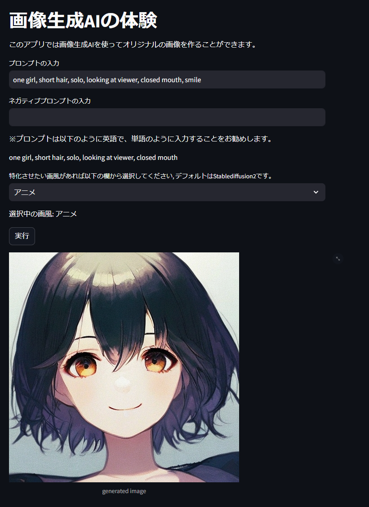
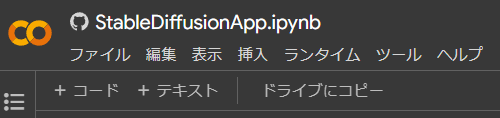
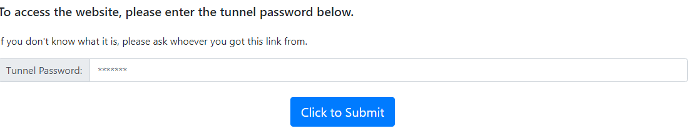

# 画像生成AIアプリ

画像生成AIを使って簡易なアプリを作成

## 実行手順

1. Google Colabを開く

2. `ドライブにコピー`を押下し、上から順番に実行しアプリを起動

※Google Colabnのランタイムを必ずGPUにすること

3. `External URL`のIPアドレスをコピーする

4. `your url is:`に書かれているuriをクリックする

5. 先ほどコピーしたIPアドレスを入力し`Click to Submit`を押す

※ ポート番号は不要です。

